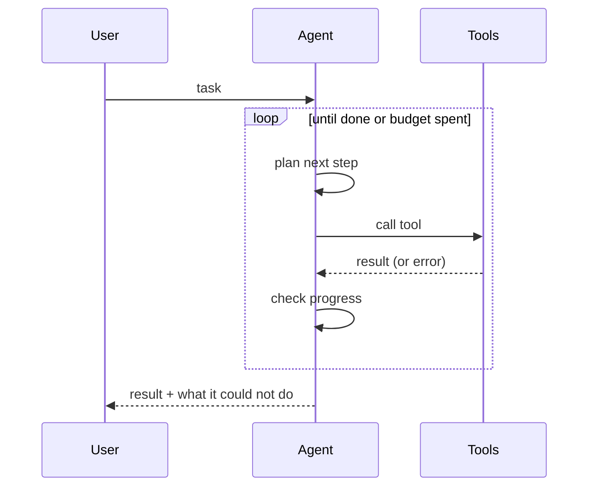

An agent is a loop with a stopping condition. Most of the engineering is in
the stopping condition.

## Where loops go wrong

<Stack layers={[
  { label: 'No budget', sub: 'runs until the bill notices', accent: 'rose' },
  { label: 'Silent failure', sub: 'tool errors swallowed, agent guesses' },
  { label: 'Tool soup', sub: '40 tools, none described well' },
  { label: 'No memory of failure', sub: 'retries the same call forever' },
]} />

## What to give it instead

- A hard step budget and a token budget, both surfaced to the model.
- Tool errors returned as text the model can read and act on, never hidden.
- Fewer, wider tools with honest descriptions of when *not* to use them.
- A scratchpad it can write to, so step N+1 can see what step N learned.

<Callout type="warn">
  Anything irreversible — writes, deletes, sends — belongs behind an explicit
  confirmation step, not behind a prompt instruction asking nicely.
</Callout>
