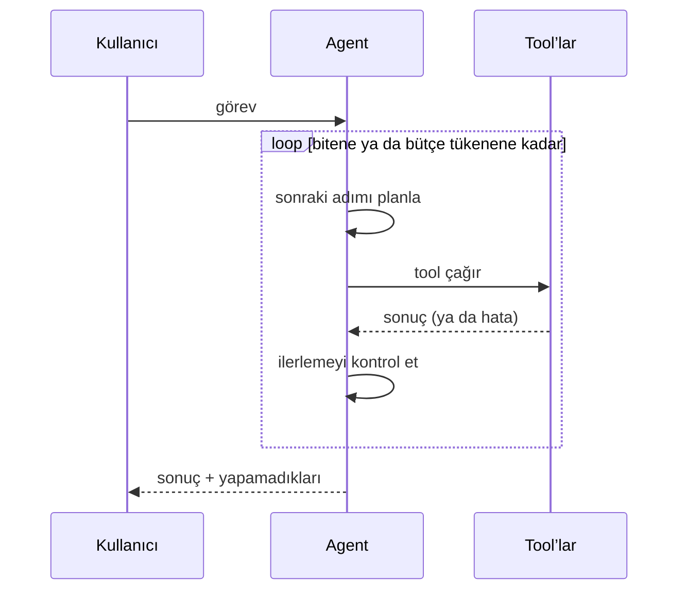

Agent, durma koşulu olan bir döngüdür. Mühendisliğin çoğu o durma koşulunda
yaşar.

## Döngüler nerede bozulur

<Stack layers={[
  { label: 'Bütçe yok', sub: 'fatura fark edene kadar çalışır', accent: 'rose' },
  { label: 'Sessiz hata', sub: 'tool hataları yutulur, agent tahmin eder' },
  { label: 'Tool çorbası', sub: '40 tool, hiçbiri düzgün tarif edilmemiş' },
  { label: 'Hata hafızası yok', sub: 'aynı çağrıyı sonsuza kadar tekrar dener' },
]} />

## Onun yerine ne vermeli

- Sert bir adım bütçesi ve bir token bütçesi; ikisi de modele görünür olsun.
- Tool hataları, modelin okuyup üzerine aksiyon alabileceği metin olarak
  dönsün; asla gizlenmesin.
- Daha az ama daha geniş tool’lar; ne zaman *kullanılmayacağını* dürüstçe
  anlatan açıklamalarla.
- Yazabileceği bir scratchpad, ki N+1. adım N. adımın öğrendiğini görebilsin.

<Callout type="warn">
  Geri alınamayan her şey — yazma, silme, gönderme — kibarca rica eden bir
  prompt talimatının değil, açık bir onay adımının arkasında durmalı.
</Callout>
