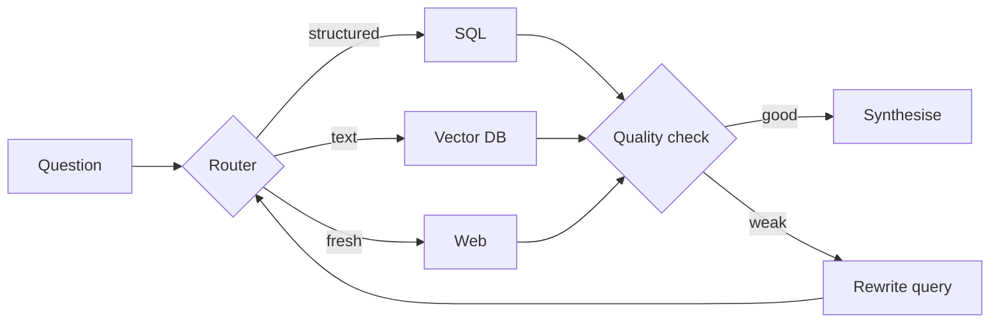

Agentic RAG is not one architecture, it is a family of patterns. Do not build
them all — add one at a time, knowing which failure it fixes.

<Stack layers={[
  { label: 'Router', sub: 'read the intent, send it to the right source', accent: 'amber' },
  { label: 'Adaptive', sub: 'score difficulty: easy → LLM, hard → agent' },
  { label: 'Corrective (CRAG)', sub: 'bad retrieval → search the web or rewrite' },
  { label: 'Self-RAG', sub: 'the model decides whether to retrieve at all' },
  { label: 'Multi-agent', sub: 'planner, researcher, synthesiser, validator' },
]} />

## Which one for which pain

- Questions go to different sources → **Router**.
- Most questions are easy, a few are hard → **Adaptive** (you pay for agentic
  quality only on the hard ones).
- Retrieval sometimes comes back empty → **Corrective**.
- Answers need several documents combined → **Multi-agent**.

<Callout type="warn" title="Infinite loop risk">
  Every pattern opens a new failure surface: planning, tool use, state
  management. Do not ship any of them without a round cap and a token budget.
</Callout>
