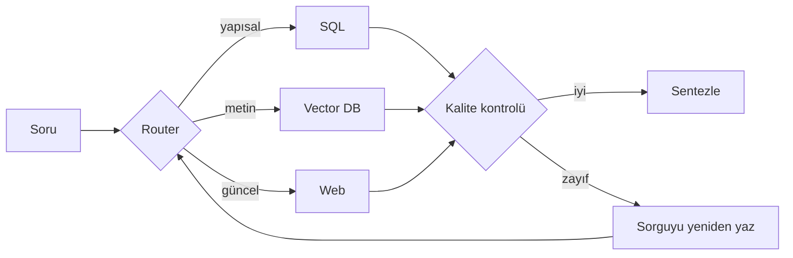

Agentic RAG tek bir mimari değil, bir pattern ailesi. Hepsini birden kurma —
hangi hatayı düzelttiğini bilerek teker teker ekle.

<Stack layers={[
  { label: 'Router', sub: 'niyeti oku, doğru kaynağa yolla', accent: 'amber' },
  { label: 'Adaptive', sub: 'zorluğu puanla: kolay → LLM, zor → agent' },
  { label: 'Corrective (CRAG)', sub: 'kötü retrieval → web’de ara ya da yeniden yaz' },
  { label: 'Self-RAG', sub: 'retrieval yapılıp yapılmayacağına model karar verir' },
  { label: 'Multi-agent', sub: 'planner, researcher, synthesiser, validator' },
]} />

## Hangi derde hangisi

- Sorular farklı kaynaklara gidiyor → **Router**.
- Soruların çoğu kolay, birkaçı zor → **Adaptive** (agentic kalitenin bedelini
  yalnızca zor olanlarda ödersin).
- Retrieval bazen boş dönüyor → **Corrective**.
- Cevaplar birkaç dokümanın birleştirilmesini gerektiriyor → **Multi-agent**.

<Callout type="warn" title="Sonsuz döngü riski">
  Her pattern yeni bir hata yüzeyi açar: planlama, tool kullanımı, state
  yönetimi. Hiçbirini tur limiti ve token bütçesi olmadan yayına alma.
</Callout>
