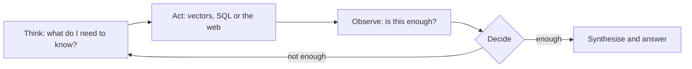

Agentic RAG is not a fixed "retrieve and generate" pipeline; it is an
orchestrator in which **the model runs its own search process.**

## How it differs from traditional RAG

<Table
  data={{
    headers: ['', 'Traditional (reactive)', 'Agentic (proactive)'],
    rows: [
      ['Flow', 'one way, deterministic', 'cyclical, dynamic'],
      ['Searches', 'one', 'as many as needed'],
      ['Data quality', 'never questioned', 'evaluated'],
      ['Missing info', 'goes unnoticed', 'triggers a new strategy'],
    ],
  }}
/>

<Callout type="idea" title="Three real gains">
  **Self-correction** — it notices the failure and rewrites the query.
  **Cross-synthesis** — it relates several sources instead of trusting one
  similarity score. **Explainability** — every thought and tool call is loggable.
</Callout>

<Sticky accent="amber">
  It does not work without a solid middle column. Without metadata, hybrid
  search and reranking, the agentic layer only makes bad retrieval expensive.
</Sticky>
