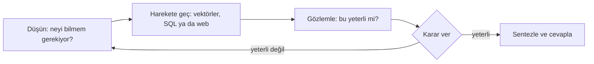

Agentic RAG sabit bir "getir ve üret" pipeline’ı değil; **modelin kendi arama
sürecini yürüttüğü** bir orchestrator.

## Geleneksel RAG’den farkı

<Table
  data={{
    headers: ['', 'Geleneksel (reaktif)', 'Agentic (proaktif)'],
    rows: [
      ['Akış', 'tek yönlü, deterministik', 'döngüsel, dinamik'],
      ['Arama sayısı', 'bir', 'gerektiği kadar'],
      ['Veri kalitesi', 'hiç sorgulanmaz', 'değerlendirilir'],
      ['Eksik bilgi', 'fark edilmez', 'yeni bir strateji tetikler'],
    ],
  }}
/>

<Callout type="idea" title="Üç gerçek kazanım">
  **Kendini düzeltme** — başarısızlığı fark eder ve sorguyu yeniden yazar.
  **Çapraz sentez** — tek bir benzerlik skoruna güvenmek yerine birden çok
  kaynağı ilişkilendirir. **Açıklanabilirlik** — her düşünce ve tool çağrısı
  loglanabilir.
</Callout>

<Sticky accent="amber">
  Sağlam bir orta sütun olmadan çalışmaz. Metadata, hybrid search ve reranking
  yoksa agentic katman kötü retrieval’ı yalnızca pahalı hale getirir.
</Sticky>
