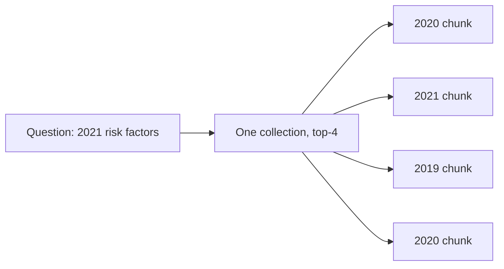

Metadata is context you can inject into every chunk: year, document title,
page, section, owner. Raw semantic search confuses these at **low precision**.

The `2021` inside the question is not a *meaning*, it is a **filter**. Vector
similarity sees the 2020 and the 2021 document as nearly identical.

## What to store

<Stack layers={[
  { label: 'Structural', sub: 'year, page, section, doc type', accent: 'lime' },
  { label: 'Derived', sub: 'chunk summary, summary of neighbours' },
  { label: 'Reverse HyDE', sub: 'which questions this chunk answers' },
]} />

<Callout type="note" title="It pays twice">
  The same metadata narrows the search (as a filter) and enriches the answer
  (source, date, page number). Cheap to write, compounding to keep.
</Callout>
