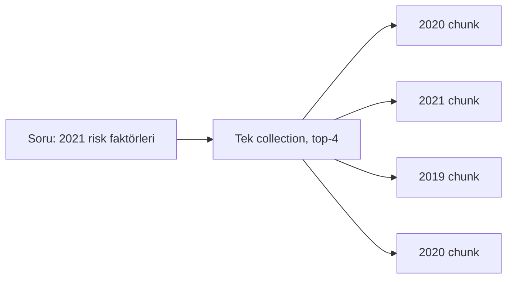
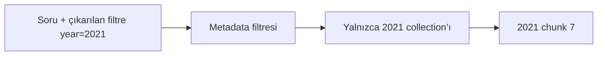

Metadata, her chunk’a enjekte edebileceğin context’tir: yıl, doküman başlığı,
sayfa, bölüm, sahip. Ham semantik arama bunları birbirine karıştırır — sonuç
**düşük precision**.

Sorunun içindeki `2021` bir *anlam* değil, bir **filtre**. Vektör benzerliği
2020 ve 2021 dokümanlarını neredeyse aynı görür.

## Ne saklamalı

<Stack layers={[
  { label: 'Yapısal', sub: 'yıl, sayfa, bölüm, doküman tipi', accent: 'lime' },
  { label: 'Türetilmiş', sub: 'chunk özeti, komşuların özeti' },
  { label: 'Ters HyDE', sub: 'bu chunk hangi soruları cevaplıyor' },
]} />

<Callout type="note" title="İki kere kazandırır">
  Aynı metadata hem aramayı daraltır (filtre olarak) hem cevabı zenginleştirir
  (kaynak, tarih, sayfa numarası). Yazması ucuz, tutması katlanarak kazandırır.
</Callout>
