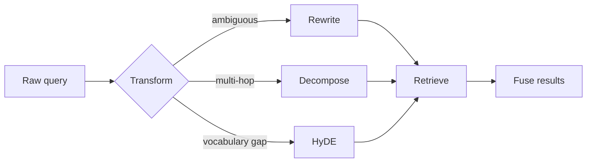

The sentence a user types is not a sentence written for search. Touching the
query before retrieval is the biggest win available without touching the index.

<Stack layers={[
  { label: 'Rewrite', sub: 'resolve the conversation: "what about that one?"', accent: 'violet' },
  { label: 'HyDE', sub: 'generate a hypothetical answer, embed that' },
  { label: 'Multi-query', sub: 'search three phrasings, fuse the results' },
  { label: 'Decomposition', sub: 'split a multi-hop question into sub-questions' },
  { label: 'Routing', sub: 'which source: vectors, SQL, the web' },
]} />

<Callout type="note" title="Why it works">
  The question and the document do not speak the same language. A user writes
  "why is my bill so high", the document says "tariff tier overage". HyDE
  closes that gap by searching with **text that looks like an answer** rather
  than with the question.
</Callout>

<Sticky accent="violet">
  Every transform is another LLM call — latency plus tokens. Measure first: how
  many of your queries are actually ambiguous? If most are one-shot, put this
  behind a router.
</Sticky>
