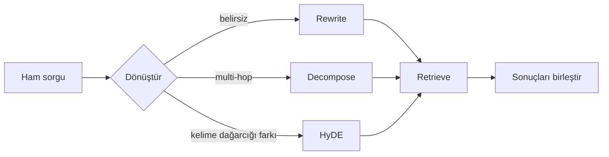

Kullanıcının yazdığı cümle, arama için yazılmış bir cümle değil. Retrieval’dan
önce sorguya dokunmak, index’e dokunmadan elde edilebilecek en büyük kazanım.

<Stack layers={[
  { label: 'Rewrite', sub: 'konuşmayı çöz: "peki ya şu?"', accent: 'violet' },
  { label: 'HyDE', sub: 'varsayımsal bir cevap üret, onu embed et' },
  { label: 'Multi-query', sub: 'üç farklı ifadeyle ara, sonuçları birleştir' },
  { label: 'Decomposition', sub: 'multi-hop soruyu alt sorulara böl' },
  { label: 'Routing', sub: 'hangi kaynak: vektörler, SQL, web' },
]} />

<Callout type="note" title="Neden işe yarıyor">
  Soru ile doküman aynı dili konuşmuyor. Kullanıcı "faturam neden bu kadar
  yüksek" yazar, doküman "tarife kademesi aşımı" der. HyDE bu farkı soruyla
  değil, **cevaba benzeyen bir metinle** arayarak kapatır.
</Callout>

<Sticky accent="violet">
  Her transform bir LLM çağrısı daha — latency artı token. Önce ölç:
  sorgularının kaçı gerçekten belirsiz? Çoğu tek atışsa, bunu bir router’ın
  arkasına koy.
</Sticky>
