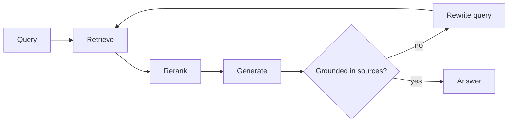

Vanilla RAG is one shot: if it retrieved the wrong thing, it cannot recover.
What actually raises quality is turning retrieval into a **closed loop**.

## Three checks that close it

- **Relevance check.** Are the retrieved chunks about the question? If not,
  search again before generating. This is the core of Corrective RAG.
- **Groundedness check.** Is every claim in the answer present in the shown
  context? If not, narrow it or say "I do not know".
- **A stopping condition.** At most N rounds. Otherwise the loop runs forever
  and you find out at the end of the month.

<Callout type="warn">
  The loop is not free: each round is a retrieval plus an LLM call. Apply it to
  the queries that **fail a check**, not to every query.
</Callout>
