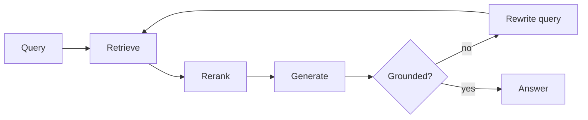

The retrieval half of RAG is where quality is won or lost. Generation is
mostly a formatting problem by comparison.

<Schema title="ingest → retrieve → answer">
  <Col gap={6}>
    <Pipeline steps={['Source|docs, tickets', 'Chunk|split + overlap', 'Embed|vector', 'Store|index']} />
    <Pipeline accent="sky" steps={['Query', 'Retrieve|top-k', 'Rerank|cross-encoder', 'Answer|grounded']} />
  </Col>
</Schema>

## What actually moves the needle

- **Chunk boundaries beat chunk size.** Splitting on headings and keeping the
  parent heading in each chunk usually helps more than tuning token counts.
- **Hybrid search.** Dense vectors miss exact identifiers, error codes and
  names. Run BM25 alongside and fuse the rankings.
- **Rerank before you widen.** Retrieving top-50 and reranking to top-5 is
  cheaper and better than sending top-20 raw into the context.
- **Cite or it did not happen.** Ask for chunk ids in the answer; it makes
  hallucination visible instead of plausible.

<Callout type="gotcha">
  A retrieval bug looks exactly like a model bug from the outside. Log the
  retrieved chunks for every request, or you will spend the week tuning
  prompts against the wrong problem.
</Callout>

## The loop to instrument

