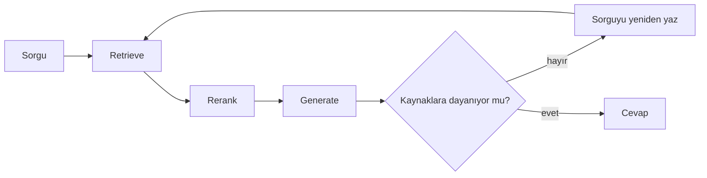

Vanilla RAG tek atış: yanlış şeyi getirdiyse toparlayamaz. Kaliteyi gerçekten
yükselten şey, retrieval’ı **kapalı bir döngüye** çevirmek.

## Döngüyü kapatan üç kontrol

- **Relevance kontrolü.** Getirilen chunk’lar soruyla ilgili mi? Değilse
  üretmeden önce tekrar ara. Corrective RAG’in çekirdeği bu.
- **Groundedness kontrolü.** Cevaptaki her iddia gösterilen context’te var mı?
  Yoksa daralt ya da "bilmiyorum" de.
- **Bir durma koşulu.** En fazla N tur. Yoksa döngü sonsuza kadar döner ve sen
  bunu ay sonunda öğrenirsin.

<Callout type="warn">
  Döngü bedava değil: her tur bir retrieval artı bir LLM çağrısı. Bunu her
  sorguya değil, **bir kontrolden geçemeyen** sorgulara uygula.
</Callout>
