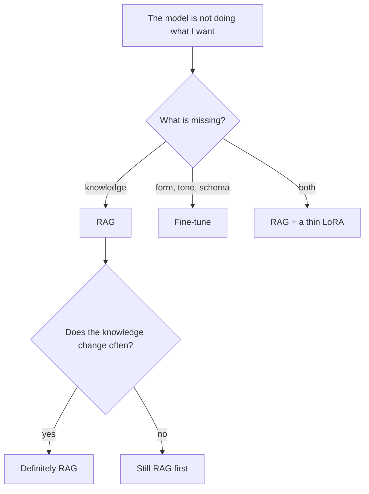

The shortest split: **RAG is for knowledge, fine-tuning is for form.** Baking
facts that change weekly into weights means retraining every week.

<Table
  data={{
    headers: ['', 'RAG', 'Fine-tune'],
    rows: [
      ['Knowledge lives', 'outside the model', 'in the weights'],
      ['Updating it', 'easy — reindex', 'hard — retrain'],
      ['Inference cost', 'higher, context is full', 'lower, prompt is short'],
      ['Context limit', 'yes, the window', 'none'],
      ['Citing sources', 'natural', 'impossible'],
      ['Good at', 'facts, fresh data', 'tone, schema, behaviour'],
    ],
  }}
/>

<Callout type="idea" title="In practice">
  Most production systems end up hybrid: build strong RAG, measure it, then
  fine-tune a small model only for the residue prompting cannot fix.
</Callout>
