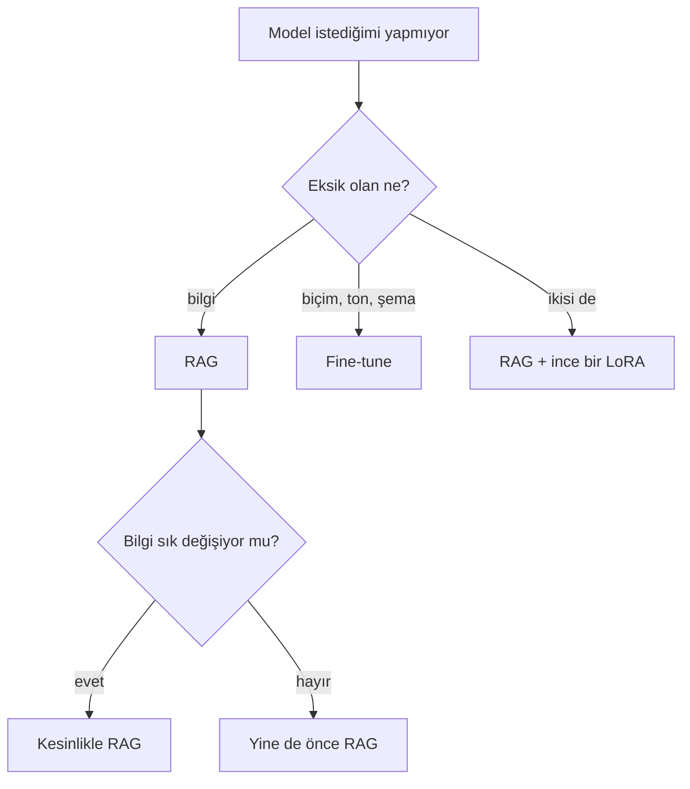

En kısa ayrım: **RAG bilgi için, fine-tuning biçim için.** Her hafta değişen
olguları ağırlıklara gömmek, her hafta yeniden eğitmek demek.

<Table
  data={{
    headers: ['', 'RAG', 'Fine-tune'],
    rows: [
      ['Bilgi nerede yaşar', 'modelin dışında', 'ağırlıklarda'],
      ['Güncellemek', 'kolay — yeniden indexle', 'zor — yeniden eğit'],
      ['Inference maliyeti', 'yüksek, context dolu', 'düşük, prompt kısa'],
      ['Context limiti', 'var, window kadar', 'yok'],
      ['Kaynak göstermek', 'doğal', 'imkânsız'],
      ['İyi olduğu yer', 'olgular, taze veri', 'ton, şema, davranış'],
    ],
  }}
/>

<Callout type="idea" title="Pratikte">
  Production sistemlerin çoğu hibrit bitiyor: güçlü bir RAG kur, ölç, sonra
  yalnızca prompt’un düzeltemediği kalıntı için küçük bir modeli fine-tune et.
</Callout>
