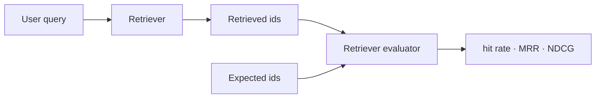

Before measuring RAG end to end, measure it **in isolation**: for a given
question, were the retrieved chunks the right ones? Answer quality depends on
that answer.

## The dataset

Input is a question, output is the **ground-truth document ids** that answer
it. Write 20 by hand, then grow it by generating synthetic questions from
chunks.

<Table
  data={{
    headers: ['Metric', 'What it tells you'],
    rows: [
      ['Hit rate', 'is the right chunk in the top-k at all'],
      ['recall@k', 'how many of the relevant chunks came back'],
      ['MRR', 'how high the first correct result sits'],
      ['NDCG', 'is the order right too — the metric for reranking'],
    ],
  }}
/>

<Callout type="idea" title="Why measure it apart">
  A retrieval failure and a generation failure look identical from outside. If
  you do not separate them you will never know whether the reranker helped.
</Callout>

<Sticky accent="slate">
  Doing RAG without a benchmark is turning knobs without knowing which change
  improved what.
</Sticky>
