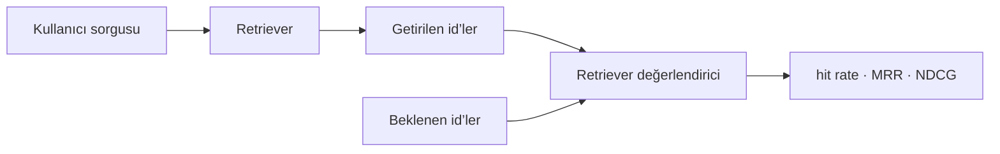

RAG’i uçtan uca ölçmeden önce **izole** ölç: verili bir soru için getirilen
chunk’lar doğru olanlar mıydı? Cevap kalitesi bu cevaba bağlı.

## Veri seti

Girdi bir soru, çıktı onu cevaplayan **ground-truth doküman id’leri**. Elle 20
tane yaz, sonra chunk’lardan sentetik sorular üreterek büyüt.

<Table
  data={{
    headers: ['Metrik', 'Ne söylüyor'],
    rows: [
      ['Hit rate', 'doğru chunk top-k içinde hiç var mı'],
      ['recall@k', 'alakalı chunk’ların kaçı geri geldi'],
      ['MRR', 'ilk doğru sonuç ne kadar üstte'],
      ['NDCG', 'sıra da doğru mu — reranking’in metriği'],
    ],
  }}
/>

<Callout type="idea" title="Neden ayrı ölçmeli">
  Retrieval hatasıyla generation hatası dışarıdan birebir aynı görünür.
  Ayırmazsan reranker’ın işe yarayıp yaramadığını asla öğrenemezsin.
</Callout>

<Sticky accent="slate">
  Benchmark olmadan RAG yapmak, hangi değişikliğin neyi iyileştirdiğini
  bilmeden düğme çevirmektir.
</Sticky>
