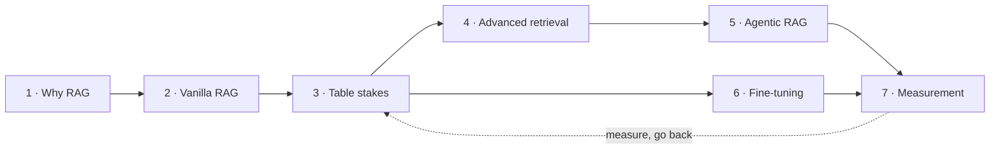

This board reads left to right as one argument: **problem → cheapest fix →
cheap wins → expensive wins → measurement.**

## One rule

Only climb a step once you have **measured** the one below it. Jumping to
agentic RAG without ever trying a different chunk size is putting the most
expensive fix on top of the cheapest problem.

<Sticky>
  The default order: Prompt → RAG → Advanced RAG → Agentic → Fine-tune →
  Distill. Every step sits on the **measured** version of the one before it.
</Sticky>
