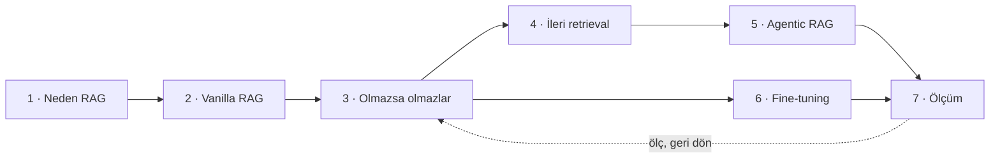

Bu pano soldan sağa tek bir argüman olarak okunur: **problem → en ucuz çözüm →
ucuz kazanımlar → pahalı kazanımlar → ölçüm.**

## Tek kural

Bir basamağa ancak altındakini **ölçtükten** sonra çık. Farklı bir chunk
boyutunu hiç denemeden agentic RAG’e atlamak, en ucuz problemin üstüne en
pahalı çözümü koymaktır.

<Sticky>
  Varsayılan sıra: Prompt → RAG → İleri RAG → Agentic → Fine-tune →
  Distill. Her adım, bir öncekinin **ölçülmüş** hali üzerine oturur.
</Sticky>
