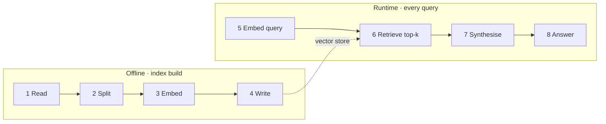

Vanilla RAG is two separate pipelines, and not confusing them is half the job:
one runs **offline** and builds the index, the other runs **on every request**.

<Schema title="two tracks, two contracts">
  <Col gap={6}>
    <Pipeline accent="sky" steps={['Source|docs, tickets', 'Chunk|split + overlap', 'Embed|vector', 'Store|index']} />
    <Pipeline steps={['Query', 'Retrieve|top-k', 'Prompt|context + question', 'Answer|with sources']} />
  </Col>
</Schema>

## Everything vanilla does not have

No router, no multi-step planning, no feedback. The model retrieves once and
answers once. The real work is setting the **contract between retrieval and
generation**: what you hand the model, and what you expect back.

<Callout type="note" title="Baseline is mandatory">
  Vanilla RAG is not a stage to skip — it is the measurement floor. Every
  advanced technique answers "how much did it help" relative to this pipeline.
</Callout>
