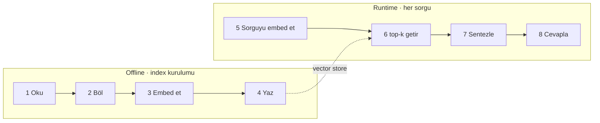

Vanilla RAG iki ayrı pipeline’dır ve ikisini karıştırmamak işin yarısıdır: biri
**offline** çalışıp index’i kurar, öteki **her istekte** çalışır.

<Schema title="iki hat, iki sözleşme">
  <Col gap={6}>
    <Pipeline accent="sky" steps={['Kaynak|dokümanlar, ticket’lar', 'Chunk|böl + overlap', 'Embed|vektör', 'Store|index']} />
    <Pipeline steps={['Sorgu', 'Retrieve|top-k', 'Prompt|context + soru', 'Cevap|kaynaklarıyla']} />
  </Col>
</Schema>

## Vanilla’da olmayan her şey

Router yok, çok adımlı planlama yok, geri bildirim yok. Model bir kez getirir,
bir kez cevaplar. Asıl iş **retrieval ile generation arasındaki sözleşmeyi**
kurmak: modele ne veriyorsun, karşılığında ne bekliyorsun.

<Callout type="note" title="Baseline zorunlu">
  Vanilla RAG atlanacak bir aşama değil — ölçümün tabanı. Her ileri teknik
  "ne kadar fayda etti" sorusunu bu pipeline’a göre cevaplar.
</Callout>
