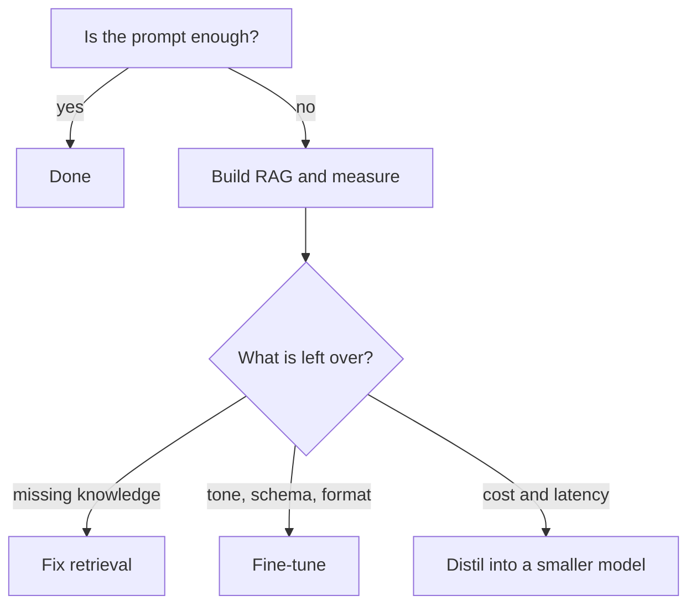

Fine-tuning is for **form**, not for facts. Burning knowledge that changes
weekly into weights means retraining on every change.

## The two legitimate jobs

1. **Distillation.** Move a strong model's behaviour into a small, cheap, fast
   one. What you gain is cost and latency.
2. **Locking in the residue.** The tone, output schema and refusal patterns
   prompting cannot hold. The long tail that never reaches 100%.

<Callout type="idea" title="The dataset-size myth">
  The "at least 1000 examples" rule died with LoRA/QLoRA. For classification
  and extraction, 200–500 **well-chosen** examples is often enough. Quality
  beats quantity.
</Callout>

<Sticky accent="rose">
  Do not break the order: Prompt → RAG → Fine-tune → Distill. Reaching for a
  fine-tune before measuring RAG is renting GPUs without knowing the problem.
</Sticky>
