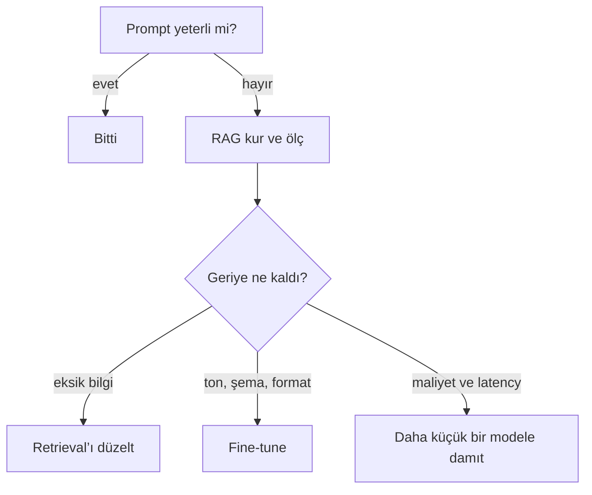

Fine-tuning olgular için değil, **biçim** için. Her hafta değişen bilgiyi
ağırlıklara yakmak, her değişiklikte yeniden eğitmek demek.

## İki meşru iş

1. **Distillation.** Güçlü bir modelin davranışını küçük, ucuz, hızlı bir
   modele taşı. Kazandığın şey maliyet ve latency.
2. **Kalıntıyı sabitlemek.** Prompt’un tutamadığı ton, çıktı şeması ve ret
   kalıpları. Hiç %100’e ulaşmayan uzun kuyruk.

<Callout type="idea" title="Veri seti boyutu miti">
  "En az 1000 örnek" kuralı LoRA/QLoRA ile öldü. Sınıflandırma ve extraction
  için 200–500 **iyi seçilmiş** örnek çoğu zaman yeterli. Nitelik niceliği
  yener.
</Callout>

<Sticky accent="rose">
  Sırayı bozma: Prompt → RAG → Fine-tune → Distill. RAG’i ölçmeden fine-tune’a
  uzanmak, problemi bilmeden GPU kiralamaktır.
</Sticky>
