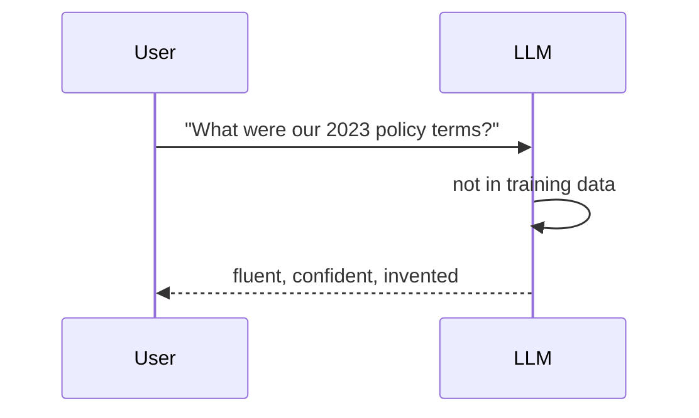

Everything a model knows is frozen in its training data. So it cannot do three
things at once: **be current, know your domain, cite a source.**

<Stack layers={[
  { label: 'Not current', sub: 'knowledge frozen at training time' },
  { label: 'Out of domain', sub: 'never saw your documents' },
  { label: 'No sources', sub: 'cannot say where it came from' },
  { label: 'Confident anyway', sub: 'the tone never changes', accent: 'rose' },
]} />

<Callout type="gotcha">
  The dangerous part of a hallucination is not that it is wrong — it is that it
  arrives **in the same tone as a correct answer**. The user cannot tell, and
  the model does not warn.
</Callout>

RAG in one sentence: *put what the model does not know in front of it before it
answers.* Retrieval-augmented generation — retrieve first, then generate.

<Sticky accent="rose">
  Fine-tuning is also an answer, just not the first one: every new fact means
  labelling, cleaning and GPU time again. For a small corpus that is overkill.
</Sticky>
