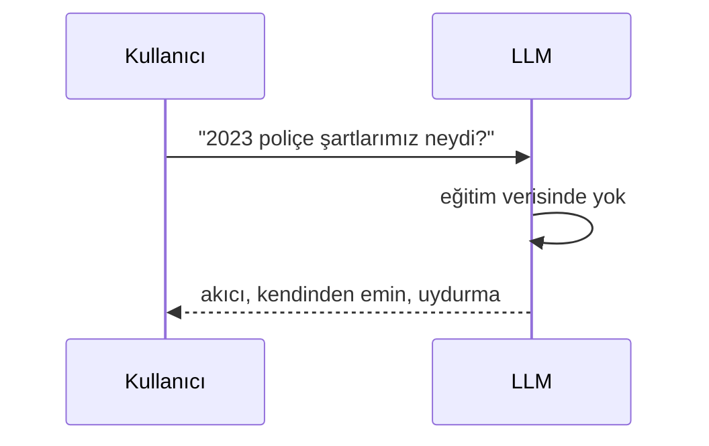

Bir modelin bildiği her şey eğitim verisinde donmuş durumda. Bu yüzden üç şeyi
aynı anda yapamaz: **güncel olmak, senin alanını bilmek, kaynak göstermek.**

<Stack layers={[
  { label: 'Güncel değil', sub: 'bilgi eğitim anında donmuş' },
  { label: 'Alan dışı', sub: 'senin dokümanlarını hiç görmedi' },
  { label: 'Kaynak yok', sub: 'nereden geldiğini söyleyemez' },
  { label: 'Yine de emin', sub: 'ton hiç değişmez', accent: 'rose' },
]} />

<Callout type="gotcha">
  Halüsinasyonun tehlikeli tarafı yanlış olması değil — **doğru bir cevapla
  aynı tonda gelmesi**. Kullanıcı ayırt edemez, model de uyarmaz.
</Callout>

RAG tek cümleyle: *modelin bilmediğini, cevap vermeden önce önüne koy.*
Retrieval-augmented generation — önce getir, sonra üret.

<Sticky accent="rose">
  Fine-tuning de bir cevap, ama ilk cevap değil: her yeni olgu yeniden
  etiketleme, temizleme ve GPU zamanı demek. Küçük bir corpus için bu fazla.
</Sticky>
