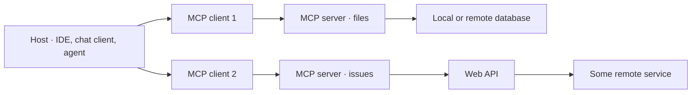

Three roles, and they are easy to blur. The **host** is the application. It
holds one **client** per connection. Each client talks to one **server**.

<Table
  data={{
    headers: ['Role', 'Who writes it', 'What it owns'],
    rows: [
      ['Host', 'the app vendor', 'the model, the UI, the approval prompts'],
      ['Client', 'the SDK', 'one connection, protocol bookkeeping'],
      ['Server', 'you', 'capabilities and the external system behind them'],
    ],
  }}
/>

The server is the only piece most people write. It exposes capabilities and
does the talking to whatever sits behind it — a local database, a web API, a
filesystem.

<Callout type="note" title="One client per server">
  A host with five servers holds five clients. That isolation is deliberate: a
  compromised or broken server cannot see the others' traffic.
</Callout>
