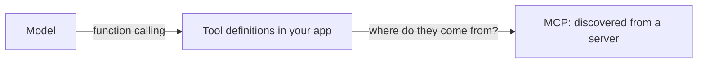

A common confusion: MCP does not replace function calling. It sits **above** it.

<Table
  data={{
    headers: ['', 'Function calling', 'MCP'],
    rows: [
      ['What it is', 'a model capability', 'a wire protocol'],
      ['Who defines the tools', 'your app, in your code', 'a server, at runtime'],
      ['Discovery', 'none — you hardcode the list', 'tools/list'],
      ['Reuse across apps', 'no, copy the code', 'yes, point at the server'],
      ['Transport', 'none, it is in-process', 'stdio or HTTP'],
    ],
  }}
/>

The model still emits a tool call the same way it always did. MCP answers the
question one level up: *where did that list of tools come from, and who else
can use it?*

<Callout type="idea" title="The practical test">
  If exactly one application will ever use this integration, plain function
  calling is fine and simpler. The moment a second client wants it, the server
  has already paid for itself.
</Callout>
