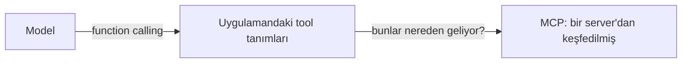

Yaygın bir kafa karışıklığı: MCP function calling'in yerini almıyor. Onun
**üstünde** oturuyor.

<Table
  data={{
    headers: ['', 'Function calling', 'MCP'],
    rows: [
      ['Nedir', 'bir model yeteneği', 'bir wire protocol'],
      ["Tool'ları kim tanımlıyor", 'senin uygulaman, senin kodunda', "bir server, runtime'da"],
      ['Discovery', 'yok — listeyi hardcode ediyorsun', 'tools/list'],
      ['Uygulamalar arası yeniden kullanım', 'hayır, kodu kopyala', "evet, server'ı göster"],
      ['Transport', 'yok, in-process', 'stdio ya da HTTP'],
    ],
  }}
/>

Model tool çağrısını hep yaptığı gibi yapmaya devam ediyor. MCP bir üst
seviyedeki soruyu cevaplıyor: *o tool listesi nereden geldi ve başka kim
kullanabilir?*

<Callout type="idea" title="Pratik test">
  Bu entegrasyonu ömrü boyunca tam olarak tek bir uygulama kullanacaksa düz
  function calling yeterli ve daha basit. İkinci bir client istediği anda
  server kendini çoktan amorti etmiş oluyor.
</Callout>
