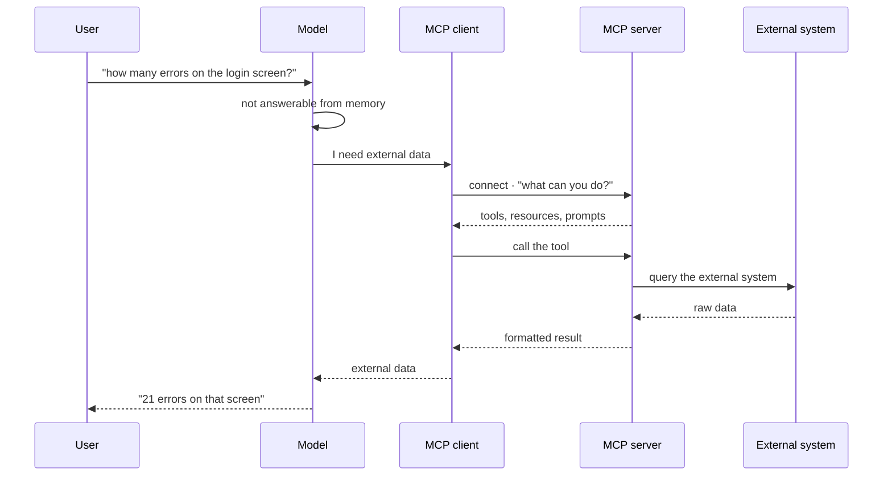

What actually happens when a user asks something the model cannot answer alone.

## The two halves

- **Discovery.** The client asks the server what it offers and gets back a
  described list. The model reads those descriptions like documentation.
- **Invocation.** The model picks one, the client calls it, the server does the
  real work and returns something the model can read.

<Callout type="idea" title="Where the intelligence sits">
  The server does not decide anything. It publishes a menu and executes what it
  is asked. The choosing happens in the model — which is exactly why the
  **descriptions** are the highest-leverage thing you write.
</Callout>
