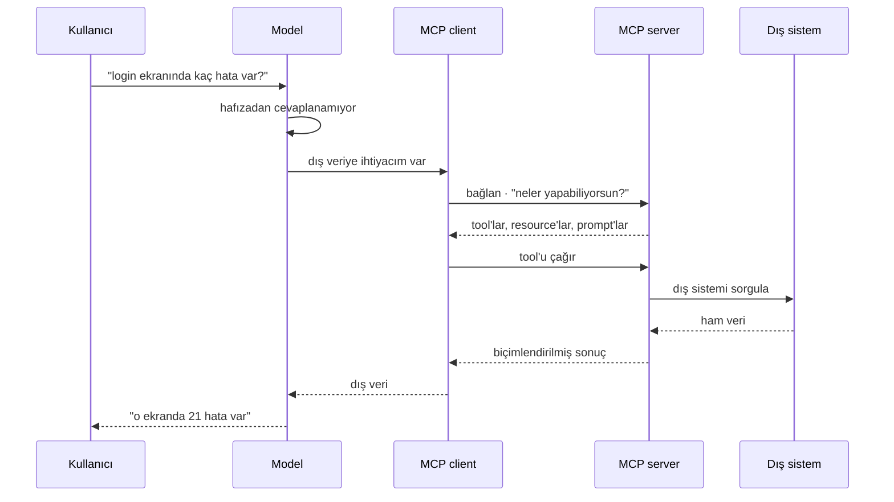

Kullanıcı, modelin tek başına cevaplayamayacağı bir şey sorduğunda aslında ne
oluyor.

## İki yarı

- **Discovery.** Client server'a ne sunduğunu soruyor ve açıklamalı bir liste
  alıyor. Model bu açıklamaları dokümantasyon okur gibi okuyor.
- **Invocation.** Model birini seçiyor, client onu çağırıyor, server asıl işi
  yapıp modelin okuyabileceği bir şey döndürüyor.

<Callout type="idea" title="Zekâ nerede oturuyor">
  Server hiçbir şeye karar vermiyor. Bir menü yayınlıyor ve istenileni
  çalıştırıyor. Seçim modelde oluyor — yazdığın en yüksek kaldıraçlı şeyin
  **açıklamalar** olmasının sebebi tam da bu.
</Callout>
