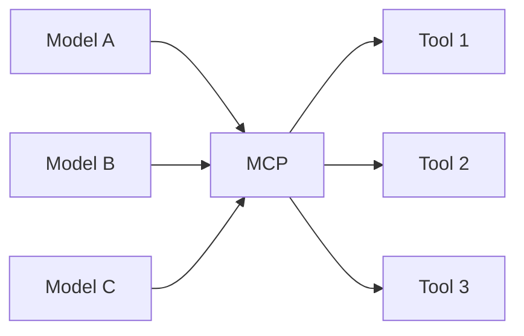

The problem underneath is simple. A model's knowledge is a fixed store, and it
is isolated from live systems — so every integration needs a bespoke bridge.

<Stack layers={[
  { label: 'Fixed knowledge', sub: 'the training set, frozen', accent: 'rose' },
  { label: 'Isolated', sub: 'no view of current data or running systems' },
  { label: 'Bespoke bridges', sub: 'one custom adapter per integration' },
]} />

## N × M

N models, M tools, every pair speaking its own protocol. That is chaos with two
costs: **wasted build effort** and, worse, **wasted maintenance effort** — M
integrations that each break on their own schedule.

One protocol in the middle collapses it to **N + M**:

<Callout type="idea" title="What you actually write">
  The thing you build is an **MCP server**, once. Every compliant client gets
  it for free — that is the whole return on the standard.
</Callout>
