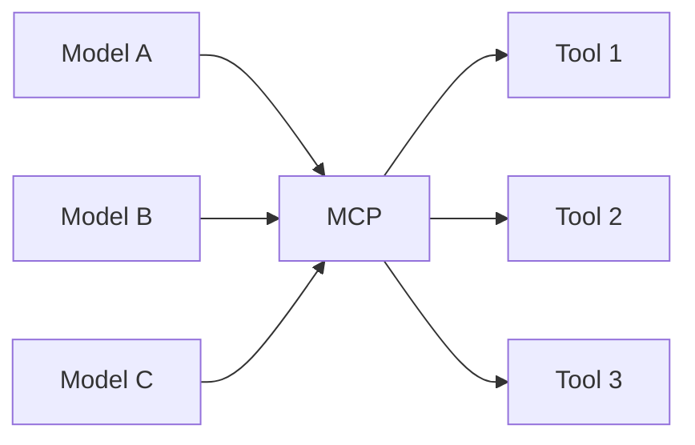

Altta yatan problem basit. Bir modelin bilgisi sabit bir depo ve canlı
sistemlerden yalıtılmış — dolayısıyla her entegrasyon ısmarlama bir köprü
istiyor.

<Stack layers={[
  { label: 'Sabit bilgi', sub: 'eğitim seti, dondurulmuş', accent: 'rose' },
  { label: 'Yalıtılmış', sub: 'ne güncel veriyi ne çalışan sistemleri görüyor' },
  { label: 'Ismarlama köprüler', sub: 'her entegrasyon için ayrı bir adapter' },
]} />

## N × M

N model, M tool, her çift kendi protokolünü konuşuyor. Bu, iki maliyeti olan
bir kaos: **boşa giden geliştirme eforu** ve daha kötüsü, **boşa giden bakım
eforu** — her biri kendi takvimine göre bozulan M entegrasyon.

Ortaya tek bir protokol koyunca bu **N + M**'ye iniyor:

<Callout type="idea" title="Aslında ne yazıyorsun">
  İnşa ettiğin şey bir **MCP server**, bir kez. Uyumlu her client onu bedavaya
  alıyor — standardın bütün getirisi bu.
</Callout>
