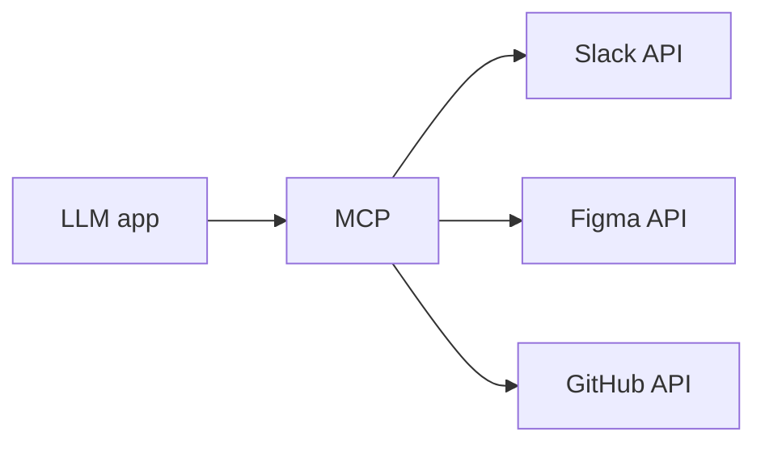

MCP is a **standardised way to connect a model to external data sources and
tools.** Open-sourced by Anthropic, and now the closest thing the ecosystem has
to a common port.

<Stack layers={[
  { label: 'Before MCP', sub: 'a hand-written adapter per system, inside your app', accent: 'rose' },
  { label: 'With MCP', sub: 'one protocol, every system behind a server', accent: 'lime' },
]} />

Before, every integration was a bespoke adapter living inside the app. After,
the app speaks one protocol and every integration is a **server** behind it —
swappable, reusable, written once by whoever owns the system.

<Sticky>
  The one-liner worth remembering: MCP is **tool discovery for LLMs.** It is
  not a new way to call a function; it is a standard way to find out what
  functions exist and what they need.
</Sticky>
