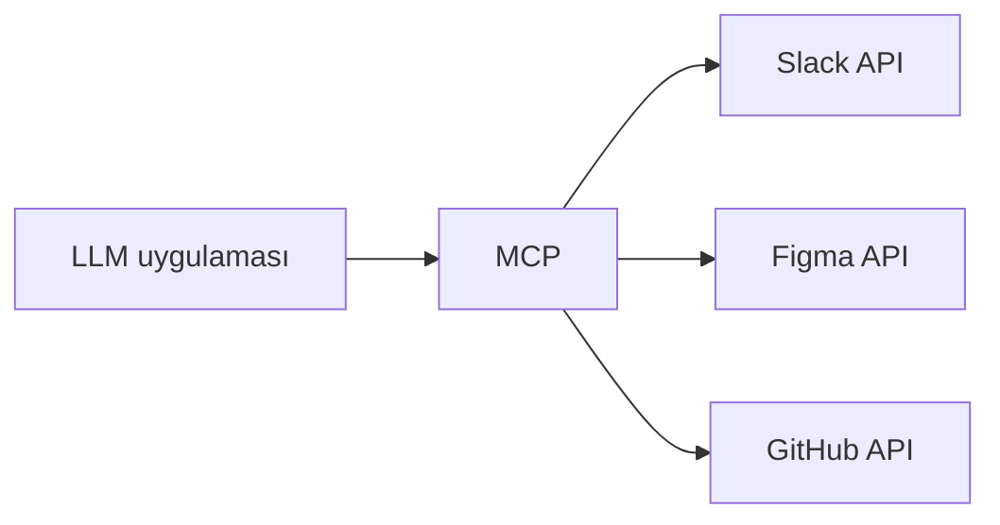

MCP, **bir modeli dış veri kaynaklarına ve tool'lara bağlamanın standart bir
yolu.** Anthropic tarafından açık kaynak olarak yayımlandı ve bugün ekosistemin
ortak bir port'a en yakın şeyi.

<Stack layers={[
  { label: "MCP'den önce", sub: 'her sistem için elle yazılmış bir adapter, uygulamanın içinde', accent: 'rose' },
  { label: 'MCP ile', sub: "tek protokol, her sistem bir server'ın arkasında", accent: 'lime' },
]} />

Önceden her entegrasyon, uygulamanın içinde yaşayan ısmarlama bir adapter'dı.
Sonrasında uygulama tek bir protokol konuşuyor ve her entegrasyon onun
arkasında bir **server** — değiştirilebilir, yeniden kullanılabilir, sistemin
sahibi tarafından bir kez yazılmış.

<Sticky>
  Akılda tutmaya değer tek cümle: MCP, **LLM'ler için tool discovery'dir.**
  Bir fonksiyonu çağırmanın yeni bir yolu değil; hangi fonksiyonların var
  olduğunu ve neye ihtiyaç duyduklarını öğrenmenin standart bir yolu.
</Sticky>
